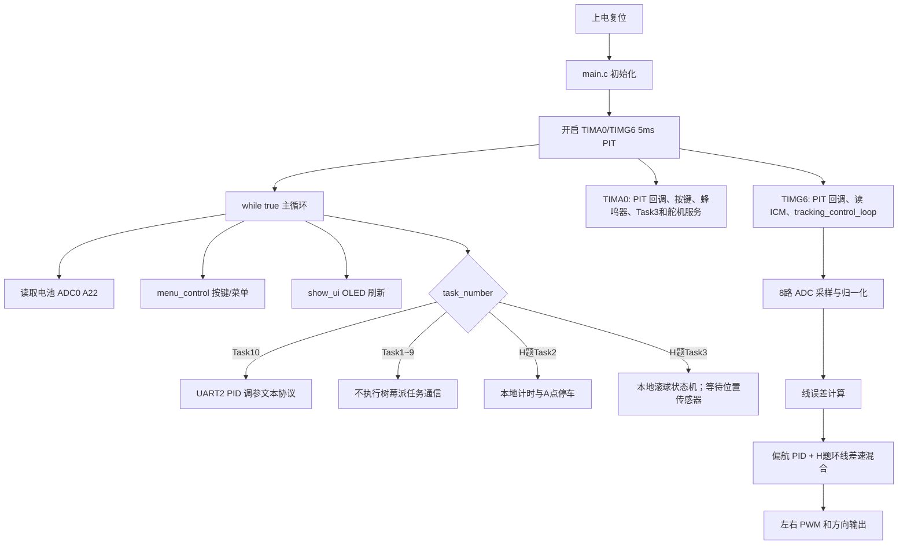

# SeekFree_common 项目上下文

> 用途：重新开启对话、接手调试或修改代码时，先阅读本文档即可快速恢复项目结构、运行链路、硬件映射和当前实现边界。
>
> 文档基于仓库当前文件整理，更新时间：2026-07-30。修改代码后请同步更新“当前工作记录”和“已知问题”。

## 1. 项目一句话概览

这是一个基于 **TI MSPM0G3507** 的 Keil/MDK 嵌入式底盘项目，使用逐飞（SeekFree）公共库和 TI DriverLib，实现 8 路模拟循迹、ICM-42688 陀螺仪姿态/偏航测量、双电机差速控制、OLED/按键菜单、蜂鸣器，以及 UART2 电脑调参接口。

当前 Task1 已改为 H 题椭圆环线持续循迹，旧目标选择、丰字赛道节点导航和直角转弯状态机已整体删除；电脑 PID 在线调参迁移至 Task10。旧 Task4~7 已改为不可发车的 H 题待实现占位，树莓派任务通信仍全部断开。

## 2. 快速恢复上下文

重新开始对话时，可以直接把下面这句话发给助手：

> 请先完整阅读仓库根目录的 `CODEX_TASK_HANDOFF.md` 和 `PROJECT_CONTEXT.md`，以当前工作区代码为准；修改前先检查 `git status`，不要覆盖、回滚或混入已有用户改动。当前底盘采集与控制实现位于 `project/code/line_sensor.c` 和 `project/code/tracking_control.c`。

接手任务时优先阅读：

1. `project/user/src/main.c`：初始化和主循环。
2. `project/user/src/isr.c`：5 ms 控制中断、UART 接收中断。
3. `project/code/line_sensor.c/.h`、`project/code/tracking_control.c/.h`：当前生效的 ADC 采集、H题环线循迹、电机和 PID 实现。
4. `project/code/display.c`：按键菜单、任务选择和启动/停止状态机。
5. `project/code/board_comm.c` / `project/README_RPI_COMM.md`：UART2 协议。

## 3. 目录结构

```text
SeekFree_common/
├─ CODEX_TASK_HANDOFF.md           当前对话、未提交修改和下一任务交接
├─ PROJECT_CONTEXT.md             本文档：项目结构和功能速览
├─ libraries/                     公共库、芯片 SDK 和外设设备驱动
│  ├─ zf_common/                  时钟、延时、调试、FIFO、中断、公共头文件
│  ├─ zf_driver/                  ADC、GPIO、PWM、PIT、SPI、UART 等驱动
│  ├─ zf_device/                  OLED、按键、IMU、屏幕、无线模块等设备驱动
│  ├─ zf_components/              SeekFree Assistant 等组件
│  ├─ components/                 组件源码/备用组件目录
│  ├─ sdk/ti/                     TI DriverLib、器件头文件
│  ├─ sdk/ti_config/              SysConfig 生成的 MSPM0 配置和启动文件
│  ├─ sdk/third_party/            CMSIS、CMSIS-DSP、MCUBoot 等第三方代码
│  └─ doc/version.txt             库版本信息
└─ project/                       当前应用工程
	   ├─ user/src/main.c             原始主循环逻辑（由包装入口包含）
	   ├─ user/src/main_pit_g6.c      当前 Keil 实际编译入口：将底盘 PIT 从 TIMA1 映射到 TIMG6
	   ├─ user/src/isr.c              原始中断逻辑（由包装入口包含）
	   ├─ user/src/isr_pit_g6.c       当前 Keil 实际编译中断入口：TIMA1 留给舵机，TIMG6 执行底盘控制
   ├─ user/inc/isr.h              中断相关声明
   ├─ code/                       当前应用层源码
   │  ├─ adc_test.c/.h            兼容聚合入口；`.c` 不参与当前 Keil 编译
   │  ├─ line_sensor.c/.h         8 路 ADC 采集、标定和线误差计算
    │  ├─ tracking_control.c/.h    H题环线循迹、电机和 PID 控制核心
   │  ├─ app_state.c/.h           页面、任务、电机使能、运行状态等共享变量
    │  ├─ display.c/.h             OLED 页面、按键菜单和启停控制
	   │  ├─ board_comm.c/.h           UART2 初始化和 Task10 PID 调参协议
	   │  ├─ ball_control.c/.h         钢球位置—速度串级控制与失视保护
	   │  ├─ ball_actuator.c/.h        摆杆角度到 B4 舵机脉宽的安全映射
	   │  ├─ task3_ball.c/.h           H题 Task3 本地状态机、计时和测量适配口
   │  ├─ icm.c/.h                 姿态融合、偏航累计角、滤波
   │  ├─ ICM_42688.c/.h            ICM-42688 SPI 驱动和校准
	   │  ├─ beep.c/.h                蜂鸣器定时控制
	   │  ├─ battery_3s.c/.h           3S 锂电电压校验、低压锁存和 PWM 补偿
	   │  ├─ servo.c/.h                B4/B5 舵机 PWM 与非阻塞软启动（当前未在 main 中初始化）
   │  └─ 新建文本文档.txt          临时/说明性文件
	   ├─ keil/                       Keil 工程与链接脚本
   │  ├─ SeekFree_MSPM0G3507_Device_Library.uvprojx
	   │  ├─ Objects/                 本地 .o/.d/.axf 等编译产物（Git 已忽略）
	   │  ├─ Listings/                本地 .map 等链接/列表产物（Git 已忽略）
   │  └─ MDK删除临时文件.bat       Keil 临时文件清理脚本
   ├─ README_RPI_COMM.md          底盘与树莓派通信说明
   ├─ pwm_readme.md               电机方向和 PWM 测试说明
   └─ 尽量不要使用的引脚.txt       硬件避用引脚清单
```

### 3.1 当前工程的源码边界

Keil 工程文件：`project/keil/SeekFree_MSPM0G3507_Device_Library.uvprojx`。

当前工程的应用源码组包含：

- `project/user/src/main_pit_g6.c`（实际编译入口，包含 `main.c`）
- `project/user/src/isr_pit_g6.c`（实际编译入口，包含 `isr.c`）
- `project/code/display.c`
- `project/code/app_state.c`
- `project/code/icm.c`
- `project/code/ICM_42688.c`
- `project/code/line_sensor.c`
- `project/code/tracking_control.c`
- `project/code/adc_test.h`（兼容聚合头）
- `project/code/board_comm.c`
- `project/code/beep.c`
- `project/code/battery_3s.c`
- `project/code/servo.c`
- `project/code/ball_control.c`
- `project/code/ball_actuator.c`
- `project/code/task3_ball.c`
- `project/code/stepper.c`
- `libraries/` 下被工程列出的逐飞库和 TI SDK 文件

根目录旧 `adc/` 已于 2026-07-30 删除；删除前确认其未被 `.uvprojx`、应用源码或脚本引用，删除后 Keil Build 为 0 error / 0 warning。`project/code/adc_test.c` 仅是未参与编译的兼容说明单元，`adc_test.h` 继续聚合 `line_sensor.h` 和 `tracking_control.h`。

## 4. 运行链路



### 4.1 `main.c` 初始化顺序

当前顺序大致为：

1. `clock_init(SYSTEM_CLOCK_80M)`：80 MHz 系统时钟。
2. `debug_init()`、延时 300 ms。
3. `oled_init()`、`key_init(5)`、`beep_init(5)`。
4. `comm_init()`：UART2，115200 baud，TX=`B15`，RX=`B16`。
5. 初始化电池 ADC：`ADC0_CH7_A22`；初始化 8 路循迹 ADC：`ADC1_CH5_B18`。
6. `adc_capture_init()`、`Motor_init()`。
7. `Init_ICM42688()`、`Filter_Init()`、`IMU_calibration()`。
8. 启动 `PIT_TIM_A0` 和 `PIT_TIM_G6`，周期均为 5 ms。
9. 设置中断优先级：TIMG6 高于 TIMA0。
10. `assign_value()` 当前为空兼容接口；关闭电机总使能初始值由 `app_state.c` 保持为 0。

### 4.2 5 ms 中断分工

- `TIMA0_IRQHandler()`：执行 PIT 回调、`key_scanner()`、`beep_actuator()`、`task3_ball_update_5ms()` 和 `servo_update_5ms()`。
- `TIMG6_IRQHandler()`：执行 PIT 回调、`get_ICM_data()`、`tracking_control_loop()`。
- `TIMA1_IRQHandler()`：仅清中断标志，保留给 B4/B5 舵机 PWM。
- `UART2_IRQHandler()`：
  - `task_number == 10`：接收 ASCII PID 命令，逐字节放入命令缓冲区。
  - 其他任务：清空 RX FIFO，不解析任何树莓派协议。

### 4.3 `tracking_control_loop()` 主控制流程

`project/code/tracking_control.c` 中的控制循环挂在 TIMG6，每次约 5 ms；ADC 采集和线误差计算位于 `project/code/line_sensor.c`：

1. `adc_capture()`：通过 `AD2/AD1/AD0` 选择 8 路模拟通道，并在 `ADC1_CH5_B18` 上逐路采样。
2. `calculate_line_error()`：将 ADC 值归一化到 0~100，按左右加权计算线误差，并做一阶低通。
3. 若 `motor_enable == 0`、处于 H题静止滚球 Task3、选中禁用的 Task4~7 或还在发车延时，强制左右 PWM 为 0。
4. Task2 从发车开始计时，累计转角约 300° 后降速并布防 A 点宽线；确认宽线后自动停车并冻结用时。
5. Task1/Task2/Task9 使用 H题趋势前瞻、动态降速和自适应差速；Task10 使用基础误差整形作为电脑调参对照。
6. 计算偏航 PID：`PID_Yaw_a()`、`PID_Yaw_gyro()`。
7. `motor_control()` 将目标速度和纠偏量合成为左右轮向前速度，执行差速限幅、斜坡限速、电压补偿和 PWM 输出。

## 5. 应用模块功能

| 文件 | 作用 | 关键接口/状态 |
|---|---|---|
| `main_pit_g6.c` | 当前编译主入口 | 包含 `main.c`，将底盘 PIT 映射到 TIMG6 |
| `isr_pit_g6.c` | 当前编译中断入口 | TIMA1 舵机隔离、TIMG6 底盘控制、TIMG 回调保护 |
| `line_sensor.c` | 8 路循迹传感器 | `adc_capture()`、`calculate_line_error()` |
| `tracking_control.c` | 当前底盘控制实现 | `curve_tracking_control()`、`tracking_control_loop()`、`motor_control()` |
| `display.c` | OLED UI 和按键状态机 | 参数编辑、任务选择、启动/停止 |
| `app_state.c` | 共享应用状态 | `task_number`、`run_state`、`motor_enable`、`battery_voltage` |
| `board_comm.c` | UART2 初始化与电脑调参 | 仅保留 Task10 PID 文本命令和 CSV 状态 |
| `icm.c` | IMU 数据处理 | `get_ICM_data()`、Mahony 姿态融合、偏航累计角 |
| `ICM_42688.c` | ICM-42688 硬件驱动 | SPI 读写、传感器初始化、陀螺仪校准 |
| `beep.c` | 蜂鸣器倒计时 | `beep_set_time()`、`beep_actuator()` |
| `battery_3s.c` | 3S 电池保护与补偿 | 采样校验、低压确认/锁存、PWM 补偿 |
| `servo.c` | B4/B5 舵机 PWM 与非阻塞软启动 | 50 Hz、0~180°；Task3 使用 B4 安全输出，Task8 使用 B4 测试 |
| `ball_control.c` | 钢球闭环控制 | 位置 PI—速度 PD、稳定判定、视觉超时和位置硬限位 |
| `ball_actuator.c` | 摆杆执行映射 | 目标摆角到 B4 脉宽、限幅和变化率限制 |
| `task3_ball.c` | H题 Task3 比赛流程 | `WAIT_SENSOR -> +50 mm -> -50 mm -> DONE_HOLD` |

## 6. 共享状态和任务

### 6.1 应用状态默认值

定义于 `project/code/app_state.c`：

| 变量 | 默认值 | 说明 |
|---|---:|---|
| `task_number` | `1` | 当前任务 1~10 |
| `run_state` | `0` | 0=停止/待机，1=运行 |
| `motor_enable` | `0` | 电机物理总使能，0 时 PWM 强制为 0 |
| `page` | `0` | 主菜单页 |
| `battery_voltage` | `0.0f` | 启动初值，主循环随后从 ADC0 更新；无效值不会参与 PWM 补偿 |
| `speed_scale` | `2.03f` | 3S 默认速度倍率，可在 UI 调整 |

### 6.2 任务行为

| 任务 | UI 行为 | 树莓派通信 | 备注 |
|---|---|---:|---|
| Task1 | 直接启动 | 断开 | H题增强循迹持续环轨，KEY4 停止；不再包含丰字导航 |
| Task2 | 直接发车 | 断开 | H题环线一圈；300°后降速，识别 A 点 5 cm 宽线后自动停车并显示用时 |
| Task3 | 直接启动 | 断开，等待未来测量适配 | H题静止滚球；当前显示 `WAIT SENSOR` 并保持 B4 安全中位 |
| Task4 | 禁用占位，KEY4 不发车 | 断开 | H题新任务待实现；底层 PWM 硬锁 |
| Task5 | 禁用占位，KEY4 不发车 | 断开 | H题新任务待实现；底层 PWM 硬锁 |
| Task6 | 禁用占位，KEY4 不发车 | 断开 | H题新任务待实现；底层 PWM 硬锁 |
| Task7 | 禁用占位，KEY4 不发车 | 断开 | H题新任务待实现；底层 PWM 硬锁 |
| Task8 | 直接启动 | 断开 | B4 舵机测试，底盘电机保持关闭 |
| Task9 | 直接启动 | 断开 | H题增强循迹持续环轨测试，行为与 Task1 底盘算法一致 |
| Task10 | 直接启动 | 不使用树莓派；保留电脑调参 | 基础 PID 环轨对照；UART2 ASCII 调参和 CSV 状态 |

任务运行时，`KEY_4` 是启动/紧急停止键；停止状态时 `KEY_1/KEY_2` 选择任务；`KEY_3` 短按切页、长按进入参数编辑。参数编辑中 `KEY_1/KEY_2` 选择参数，`KEY_3/KEY_4` 加减，`KEY_1` 长按退出。

Task2 应把小车放在 A 点并朝 A→B 方向，保证沿赛道顺时针行驶。`StopDly`
参数以 5 ms 为步长调整检测到启停线后继续前进的时间，用于对齐车体指定测试位置
与停车基准线；详细标定步骤见 `project/README_TASK2_H_LAP_STOP.md`。

## 7. 传感器、电机和引脚映射

### 7.1 8 路循迹 ADC

模拟输入固定为 `ADC1_CH5_B18`，通过三根多路复用选择线切换 8 路：

| 选择线 | 引脚 |
|---|---|
| `AD2` | `B8` |
| `AD1` | `B9` |
| `AD0` | `B14` |

选择表：`000~111` 对应逻辑通道 `CH1~CH8`，保存到 `adc_raw_value[0..7]`。`adc_mode` 含义：0=正常归一化，1=采集白底背景，2=采集黑线前景。

### 7.2 电池电压

- ADC 输入：`ADC0_CH7_A22`
- 主循环：`battery_voltage = adc_mean_filter_convert(..., 10) * 0.0089388f`
- 使用 3S 锂电策略：标称 `11.1 V`，低压阈值 `10.2 V`，连续 `500 ms` 后锁存停机；恢复阈值为 `10.8 V`。
- 仅 `9.0~13.5 V` 的有限采样值参与补偿；0、NaN、无穷大或明显异常电压会直接输出 0 PWM，避免除法异常。
- 补偿后的 PWM 上限为 `4000`，默认速度倍率 `2.03` 用于接近原 6S 默认起步电压。

### 7.3 双电机

| 电机 | 方向 | PWM |
|---|---|---|
| 右轮 | `B11` (`DIR_R`) | `PWM_TIM_G0_CH0_B10` (`PWM_R`) |
| 左轮 | `A27` (`DIR_L`) | `PWM_TIM_G7_CH0_A26` (`PWM_L`) |

`Motor_init()`：17 kHz PWM，初始方向脚为高电平。实际运行时：速度 `>= 0` 写方向 0，速度 `< 0` 写方向 1。正常 PWM 计算先按 `abs(speed) * speed_scale * 30`，再做上限、电压补偿和最终限幅。

### 7.4 ICM-42688

- SPI：`SPI_1`
- SCK：`B23`
- MOSI：`B22`
- MISO：`B21`
- CS：`B19`
- `Yaw_TotalAngle`：累计偏航角
- `Yaw_g`：实时偏航角速度，仅供本地控制和 OLED 调试

### 7.5 当前记录的避用引脚

见 `project/尽量不要使用的引脚.txt`：`A23、A21、A19、A20、A5、A6、A4、A3`。其中部分引脚涉及 VREF/HFXT/LFXT 等系统配置，改动前必须同时检查 `libraries/sdk/ti_config/ti_msp_dl_config.h`。

## 8. UART2 与树莓派断开状态

详细说明以 `project/README_RPI_COMM.md` 为准。

### 8.1 当前边界

- UART2 仍初始化为 115200 baud，TX=`B15`，RX=`B16`，供 Task10 电脑 PID 调参使用。
- 主循环不再发送旧 Task3~7 二进制状态包。
- UART2 中断不再解析旧 Task7 `[55 AA 01 01]` 放行包。
- 非 Task10 状态下收到的 UART2 字节直接清空。
- Task3 的 `task3_ball_submit_measurement()` 只是未来测量适配口，当前没有通信调用者。

### 8.2 Task10 PID 调参协议

UART2 接收以换行结束的 ASCII 命令：

```text
STATUS
SET P:7.0 I:0 D:0.2
```

也支持 `KP/KI/KD` 形式，例如 `SET KP:7 KI:0 KD:0.2`。成功返回 `# ACK: ...`，查询返回 `# STATUS: ...`，格式错误返回 `# ERR: BAD_SET_FORMAT`。

主循环向上位机发送 CSV：

```text
timestamp,setpoint,input,pwm,error,Kp,Ki,Kd\r\n
```

当前 `setpoint=0`，`input=line_error_filtered`，`pwm=Duty_dS_applied`，`error=-input`。

## 9. H题环线循迹模式

- Task1、Task2、Task9 共用 `curve_tracking_control()`：根据线误差趋势和持续偏差形成弧线前瞻与曲率保持量，并连续调整基础速度、慢轮下限和差速权限。
- Task10 使用 `standard_tracking_shape_line_error()`，保留较简单的基础误差整形，便于通过电脑观察和修改 `PIDK_YA`。
- `PIDK_YA` 是全局共享参数；在 Task10 调整完成后切换到 Task1/Task2/Task9，新的参数值仍然生效，但增强误差整形不同，必须重新低速验证。
- 所有当前底盘任务只进行环线向前差速，不再包含旧丰字路口识别、闭眼定角转向、内侧轮反转或靶点坐标规划。

## 10. 编译、调试和修改注意事项

### 10.1 编译入口

1. 使用 Keil MDK 5.37 打开 `project/keil/SeekFree_MSPM0G3507_Device_Library.uvprojx`。
2. 确认 Device 为 `MSPM0G3507`，目标配置为 `__MSPM0G3507__`。
3. Build/Rebuild 后，主要产物位于 `project/keil/Objects/`，例如 `.axf`；链接列表位于 `project/keil/Listings/`。这些均为本地生成物，不提交到 Git。
4. 工程依赖 `project/code`、`project/user/inc` 以及 `libraries` 的 include path。

### 10.2 修改前检查

- 先执行 `git status --short`，当前工作区可能存在用户未提交改动和 Keil 生成物改动。
- 修改传感器采集和标定时编辑 `project/code/line_sensor.c/.h`；修改循迹、导航、电机或 PID 时编辑 `project/code/tracking_control.c/.h`。
- `libraries/sdk/ti_config/ti_msp_dl_config.*` 是 SysConfig 生成文件；修改前确认是否应通过 SysConfig 重新生成。
- 不要在 5 ms 中断中加入 OLED 刷屏、长延时、复杂字符串格式化或阻塞通信。
- 中断和主循环共享的变量应注意 `volatile`、临界区和快照读取；当前 `main.c` 已对部分状态读取使用全局中断保护。
- B4/B5 舵机 PWM 使用 TIMA1；底盘 5 ms 控制已迁移至 TIMG6，因此调用 `servo_init()` 不再与底盘 PIT 冲突。
- 舵机公共接口只能选择 `SERVO_CHANNEL_1`（B4）或 `SERVO_CHANNEL_2`（B5）；不要直接用电机 PWM 或 TIMG6 初始化舵机。

### 10.3 推荐调试顺序

1. 先确认 `run_state=0` 时两个 PWM 始终为 0。
2. 检查 ADC 白底/黑线标定，确认 `adc_calibrated_value[0..7]` 在 0~100 附近变化。
3. 检查 `line_error_filtered` 的符号和零点，再调 `PIDK_YA`。
4. 单独验证左右电机方向和相同 PWM，参考 `project/pwm_readme.md`。
5. 检查 ICM 初始化、静止校准、`Yaw_g` 符号和 `Yaw_TotalAngle` 累计。
6. 当前先不要联调树莓派；UART2 只在 Task10 检查电脑调参，Task4~7 等替换完成后再设计新的测量协议。

## 11. 已知边界和待确认项

- 根目录旧 `adc/` 重复实现已经删除；当前唯一生效的底盘采集与控制来源是 `line_sensor.c` 和 `tracking_control.c`。
- `adc_test.h` 仍是兼容聚合头；删除或改名之前必须先解除 `zf_common_headfile.h`、`board_comm.c` 等现有包含关系。
- `servo.c` 已加入 Keil 工程；Task3 启动时初始化 B4 并使用安全脉宽，Task8 仍是独立 B4 测试。两者必须通过任务菜单保持互斥。
- `assign_value()` 目前为空，仅用于兼容 `main.c` 调用。
- `project/keil/Objects/`、`Listings/` 中大量文件是编译生成物，不应作为业务逻辑来源阅读或手工修改。
- 中文注释在部分旧文件中存在编码显示异常；判断逻辑时以 C 代码、宏、函数和当前 README 为准。
- `project/尽量不要使用的引脚.txt` 当前显示可能受文件编码影响，具体清单已在本文第 7.5 节保留。
- H题 Task1/Task2/Task9 使用增强环线循迹；Task2 额外执行计时、末段减速和 A 点宽线停车。Task1/Task9/Task10 均由 KEY4 或安全保护停止。
- Task2 的宽线阈值和 `StopDly` 仍需以实车 ADC 数据及车体指定测试位置完成标定；软件编译通过不等于已经满足 20 s 与 2 cm 实测指标。
- H题 Task3 的本地状态机、计时、底盘锁止和 B4 安全输出已经接入，但树莓派通信按当前阶段要求全部断开。没有摄像头位置时停在 `WAIT SENSOR`，不能据此宣称满足 5 s 与 ±1 cm。
- 旧 Task4~7 的目标数量规则、启动入口和 Task7 等待放行状态已删除；四个菜单位置保留为待实现占位，并在 UI 与 PWM 输出层双重禁止底盘启动。
- 旧 Task1 的目标选择、丰字节点导航、90°/180°转向和路口状态机已整体删除；UART2 电脑 PID 调参已迁移至 Task10。

## 12. 当前工作记录

| 日期 | 内容 | 涉及文件 | 验证状态 |
|---|---|---|---|
| 2026-07-23 | 初次整理项目结构和运行链路 | `PROJECT_CONTEXT.md` | 已完成静态梳理，未执行硬件联调 |
| 2026-07-23 | 3S 电池保护、TIMG6 底盘 PIT 迁移、舵机 TIMA1 隔离、PID 串口校验与 TIMG 空回调保护 | `battery_3s.*`、`servo.*`、`main_pit_g6.c`、`isr_pit_g6.c`、`board_comm.c` | Keil Rebuild 0 error；仍未完成完整实机联调 |
| 2026-07-23 | 舵机接口限制为 B4/B5，并将软启动改为 TIMA0 非阻塞状态机 | `servo.*`、`isr_pit_g6.c` | Keil Rebuild 0 error；待舵机实机验证 |
| 2026-07-29 | 按 H 题 0.5 m 半径环形赛道完善直线/弯道统一循迹：趋势前瞻、中心连续增益、有效线迟滞、动态降速与差速限幅、转弯恢复隔离 | `tracking_control.c` | 数值回放通过；Keil Build 0 error / 0 warning；待实车低速验证与参数微调 |
| 2026-07-29 | 新增 Task9 H 题环形轨道持续循迹测试：启动即行驶、绕过丰字路口状态机、KEY4 手动停止 | `app_state.h`、`display.c`、`tracking_control.c` | Keil Build 0 error / 0 warning；待实车验证 |
| 2026-07-29 | 根据实车“直线受力恢复慢、右弯约 1/4 圆弧后从外侧冲出”反馈增强循迹：恢复小偏差基础增益、加快弯道响应、弯中降速，并联动放宽内侧轮最低速度与差速 | `tracking_control.c` | Keil Build 0 error / 0 warning；待同方向分段复测 |
| 2026-07-29 | 将 H 题趋势前瞻、动态降速和自适应差速严格限制到 Task9；Task1、Task4~7 恢复 H 题算法接入前的误差整形、固定速度、慢轮下限和差速参数 | `tracking_control.c` | Keil Build 0 error / 0 warning；待分别复测 Task9 与原循迹任务 |
| 2026-07-29 | 新增 Task10 原 PID 环轨对照测试：与 Task9 一样持续运行并绕过直角路口判断，但使用 Task1~7 原直线 PID 控制参数 | `app_state.h`、`display.c`、`tracking_control.c` | Keil Build 0 error / 0 warning；待与 Task9 同速实车对照 |
| 2026-07-29 | 对照实测 Task9 约 1/4 圆弧外冲、Task10 约 1/8 圆弧外冲；Task9 第三版增加有界曲率保持积分、等效外环增益，并在 OLED 调试页显示目标角速度 `Cmd` 与实际差速 `Dif` | `tracking_control.c`、`display.c` | 数值释放测试通过；Keil Build 0 error / 0 warning；待右弯第三轮复测 |
| 2026-07-30 | 删除根目录未被工程引用的旧 `adc/` 重复实现，并同步源码边界说明 | `adc/*`、`PROJECT_CONTEXT.md` | 删除范围仅 4 个旧文件；Keil Build 0 error / 0 warning |
| 2026-07-30 | 将旧云台 Task2 替换为 H题环线一圈停车：复用 Task9 增强循迹，增加 300°末段减速、A点宽线确认、5 ms 计时、可调停车延时和 OLED 完成页；Task9 保持连续运行 | `app_state.h`、`display.c`、`tracking_control.c/.h`、`board_comm.c` | Keil Build 0 error / 0 warning；待实车标定宽线阈值、`StopDly` 并验证 ≤20 s、≤2 cm |
| 2026-07-30 | 将旧云台 Task3 替换为 H题静止滚球往返框架，接入本地状态机、5 ms 计时、底盘锁止、B4 安全输出和 OLED；同时删除旧 Task3~7 树莓派收发路径，Task1 电脑调参保留 | `task3_ball.*`、`ball_control.*`、`ball_actuator.*`、`display.c`、`main.c`、`isr.c`、`board_comm.*` | Keil Build 0 error / 0 warning；无位置源时安全停在 `WAIT SENSOR`，待后续单独接入摄像头测量 |
| 2026-07-30 | 清除旧 Task4~7 的目标选择规则、启动入口和 Task7 等待状态，保留 Task1 仍在使用的共享导航；Task4~7 改为不可发车占位并增加底层 PWM 硬锁 | `app_state.h`、`display.c`、`tracking_control.c/.h` | Keil Rebuild 0 error / 0 warning；待后续逐项实现并上板验证 |
| 2026-07-30 | 将 Task1 替换为 H题增强环线持续循迹，把 UART2 电脑 PID 调参迁移至 Task10，并整体删除目标选择、丰字节点导航和直角/调头状态机 | `app_state.h`、`display.*`、`tracking_control.*`、`board_comm.*`、`main.c`、`isr.c` | Keil Rebuild 0 error / 0 warning；固件 Code 60532 bytes，待 Task1/Task10 实车复测 |

后续每次重要修改建议追加一行，至少记录：修改目的、实际生效文件、是否编译通过、是否上板验证。

## 13. 适合继续追踪的关键问题模板

```text
问题现象：
复现任务：Task__ / 停止态 / 上电初始化
相关状态：run_state=__, motor_enable=__, task_number=__
关键观测：line_error_filtered=__, Yaw_TotalAngle=__, Yaw_g=__
涉及文件：
最近改动：
编译结果：
上板结果：
```
